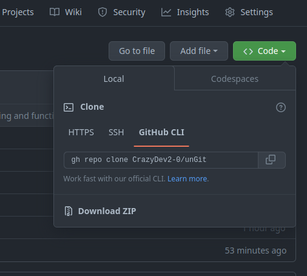
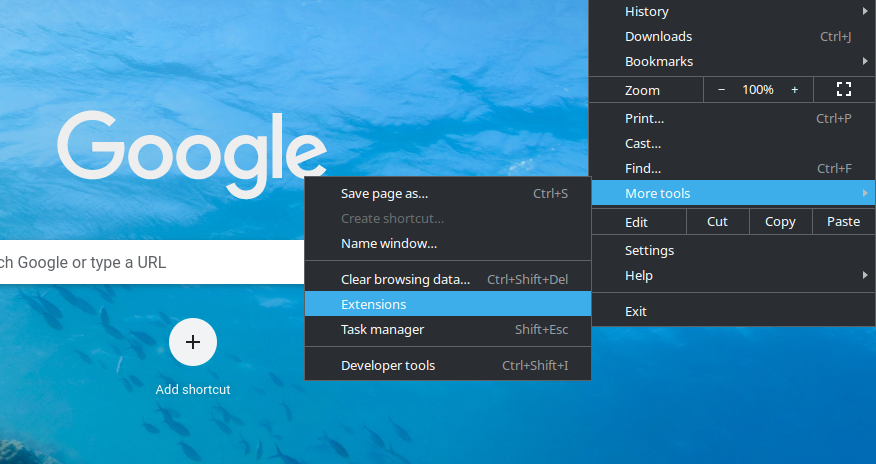
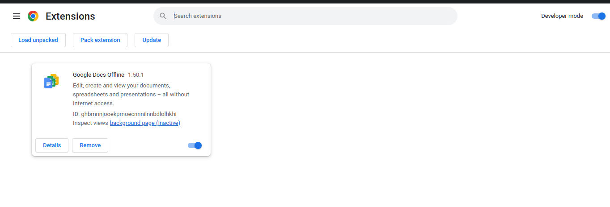

### Manage Your OpenSource in One Place

- A chrome extension to track and manage all your **PRs** and **Issues**. Get notified instantly when updated.

## Tech Stack:

## Installation and Usage:

- **Download**: Download the source Zip/Clone the repository. 

- **Open Chrome > goto &#8942; > Select More Tools Option > Go to Extensions Menu > Switch On the Developer Mode > Select Load Unpacked Then Select the Source Folder.** 
  

- Enter your **GitHub UserID** to enter and use it.

https://user-images.githubusercontent.com/80196675/215314697-344156f9-7212-42aa-a77e-a53a37b08b83.mp4

### Additional Backend:
- <a href="https://github.com/CrazyDev2-0/backend-ungit">Follow this link: </a> https://github.com/CrazyDev2-0/backend-ungit

### Deployed backend:
- https://hacknitr.tanmoy.codes/

### Postman collection to explore API:
- 

### Contributors:

- **Team CrazyDev**:
  - [Amartya Chakraborty](https://github.com/cAmartya)
  - [Tanmoy Sarkar](https://github.com/Tanmoy741127)
  - [Debarghya Maitra](https://github.com/The-Debarghya)
  - [Snehanjan Roy](https://github.com/Snehanjan2001)
